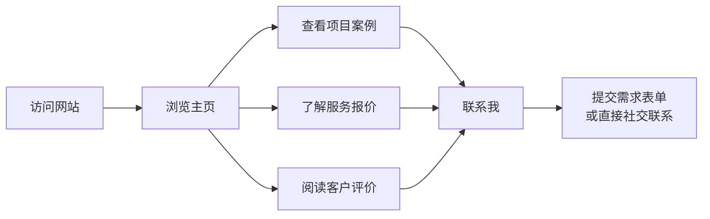

## 1. 产品概述
一个炫酷创意风格的个人接单名片网站，展示技能、项目案例、服务报价，接收客户需求。
- 主要目标用户为有软件开发需求的企业和个人客户
- 市场价值：提升个人接单的专业形象，方便客户了解和联系

## 2. 核心功能

### 2.1 用户角色
| 角色 | 注册方式 | 核心权限 |
|------|----------|----------|
| 普通访客 | 无需注册 | 浏览内容、提交联系表单 |

### 2.2 功能模块
1. **首页**：Hero 区域、导航栏、语言切换、服务预览、项目预览、客户评价预览
2. **项目案例页**：完整项目展示，支持按技术栈筛选
3. **服务报价页**：详细服务内容与定价
4. **客户评价页**：客户好评与推荐
5. **联系页**：需求提交表单与社交联系方式

### 2.3 页面详情
| 页面 | 模块 | 功能描述 |
|------|------|----------|
| 首页 | Hero 区域 | 动态渐变背景、个人介绍动画效果 |
| 首页 | 导航栏 | 吸顶导航、滚动动画、语言切换按钮 |
| 首页 | 服务预览 | 卡片网格、悬停效果、渐变边框 |
| 首页 | 项目预览 | 项目卡片、交错动画、技术栈标签 |
| 首页 | 评价预览 | 客户评价轮播或网格 |
| 首页 | 联系引导 | 醒目的行动号召区域 |
| 项目案例页 | 项目展示 | 完整项目列表，支持技术栈筛选 |
| 项目案例页 | 项目详情 | 弹窗或独立页面展示项目详情 |
| 服务报价页 | 服务详情 | 服务描述、定价层级 |
| 客户评价页 | 评价画廊 | 所有客户评价展示 |
| 联系页 | 联系表单 | 客户填写需求描述和联系方式 |
| 联系页 | 社交链接 | 微信、QQ、GitHub、邮箱联系方式 |

## 3. 核心流程
用户访问网站 → 浏览主页内容（技能展示、项目案例、客户评价）→ 了解服务详情与报价 → 通过表单提交需求或直接通过社交方式联系 → 完成潜在客户转化。

## 4. 用户界面设计
### 4.1 设计风格
- **主色调**：深空暗色 (#0f172a) 搭配鲜艳强调色（电光青 #06b6d4、热粉 #ec4899）
- **辅助色**：丰富渐变、霓虹发光效果
- **按钮风格**：渐变填充、圆角、悬停上浮效果、微光效果
- **字体**：展示字体（Clash Display 等粗体展示字体）搭配正文（Inter 或 Roboto Mono 增加科技感）
- **布局风格**：非对称网格、元素重叠、对角线构图
- **图标风格**：粗体几何图标，渐变填充

### 4.2 页面设计概览
| 页面 | 模块 | UI 元素 |
|------|------|---------|
| 首页 | Hero 区域 | 全屏渐变网格背景、文字动画揭示、浮动几何图形、滚动故障效果 |
| 首页 | 服务 | 毛玻璃卡片、渐变边框、悬停倾斜、图标变形 |
| 首页 | 项目 | 交错卡片网格、缩略图悬停放大、技术栈药丸标签、滚动触发入场 |
| 首页 | 评价 | 引用卡片配模糊背景、头像动画、星级评分 |
| 所有页面 | 导航栏 | 透明到实色滚动过渡、活跃链接下划线、平滑滚动 |

### 4.3 响应式设计
- 桌面优先设计，优雅适配移动端
- 触摸优化交互元素
- 移动端堆叠布局，桌面端复杂网格
- 跨视口优化排版缩放

### 4.4 3D 场景指引
- 环境：暗色空间，微妙粒子雾气
- 灯光：霓虹强调光、体积光线
- 相机：视差滚动效果、鼠标移动微旋转
- 构图：浮动几何体、轨道运动
- 交互：悬停触发微动画、点击特效
- 后处理：泛光、色差营造"复古未来科技"感
- 资源来源：Three.js 基础几何体、自定义着色器
- 性能预算：绘制调用控制在 50 以内，优先使用 CSS 动画而非 WebGL

