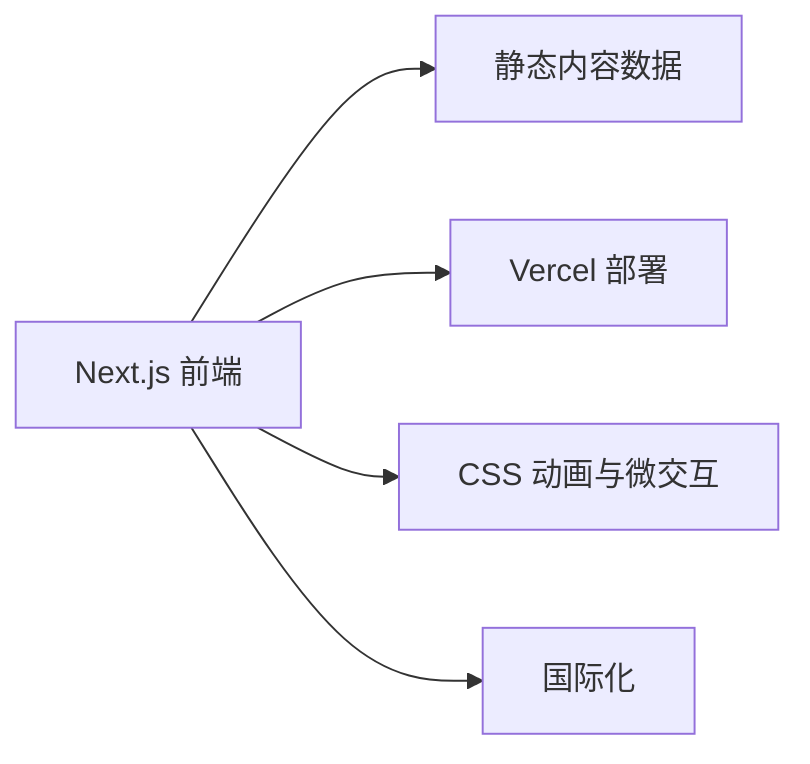

## 1. 架构设计


## 2. 技术说明
- **前端**：Next.js 14 + React 18 + Tailwind CSS 3 + TypeScript
- **初始化工具**：Create Next App（--typescript --tailwind）
- **后端**：无（纯静态内容）
- **数据库**：无（数据存储在 TypeScript 文件中）
- **部署**：Vercel（原生 Next.js 支持）
- **动效库**：Framer Motion（动画）、Lucide React（图标）、clsx/tailwind-merge（类名管理）

## 3. 路由定义
| 路由 | 用途 |
|------|------|
| / | 首页：Hero、服务、项目、评价 |
| /projects | 项目案例展示页 |
| /services | 服务报价详情页 |
| /testimonials | 客户评价页 |
| /contact | 联系表单与联系方式 |

## 4. 数据模型
### 4.1 静态数据结构

#### 项目数据
```typescript
interface Project {
  id: string;
  title: { zh: string; en: string };
  description: { zh: string; en: string };
  image: string;
  techStack: string[];
  link?: string;
  featured: boolean;
}
```

#### 服务数据
```typescript
interface Service {
  id: string;
  title: { zh: string; en: string };
  description: { zh: string; en: string };
  price: { zh: string; en: string } | null; // null 表示"面议"
  icon: string;
  featured: boolean;
}
```

#### 评价数据
```typescript
interface Testimonial {
  id: string;
  name: { zh: string; en: string };
  role: { zh: string; en: string };
  content: { zh: string; en: string };
  avatar: string;
  rating: number;
}
```

## 5. 项目结构
```
freelance-portfolio/
├── .trae/documents/
├── src/
│   ├── app/
│   │   ├── layout.tsx
│   │   ├── page.tsx（首页）
│   │   ├── projects/
│   │   │   └── page.tsx
│   │   ├── services/
│   │   │   └── page.tsx
│   │   ├── testimonials/
│   │   │   └── page.tsx
│   │   └── contact/
│   │       └── page.tsx
│   ├── components/
│   │   ├── layout/
│   │   │   ├── Navbar.tsx
│   │   │   └── Footer.tsx
│   │   ├── home/
│   │   │   ├── Hero.tsx
│   │   │   ├── Services.tsx
│   │   │   ├── Projects.tsx
│   │   │   ├── Testimonials.tsx
│   │   │   └── ContactCTA.tsx
│   │   └── shared/
│   │       ├── ProjectCard.tsx
│   │       ├── ServiceCard.tsx
│   │       ├── TestimonialCard.tsx
│   │       ├── LanguageSwitch.tsx
│   │       └── GradientButton.tsx
│   ├── data/
│   │   ├── projects.ts
│   │   ├── services.ts
│   │   └── testimonials.ts
│   ├── hooks/
│   │   ├── useLanguage.ts
│   │   └── useScrollAnimation.ts
│   └── utils/
│       ├── cn.ts（clsx + tailwind-merge）
│       └── i18n.ts
├── public/
│   └── images/
├── next.config.js
├── tailwind.config.js
├── tsconfig.json
├── package.json
└── vercel.json
```

## 6. 关键技术决策
1. **静态站点生成**：使用 Next.js 静态生成，优化性能和 SEO
2. **CSS 优先动画**：优先使用 CSS 关键帧和过渡，而非 JS 动画，提升性能
3. **无外部库国际化**：基于 Context 的简单语言切换，保持包体积最小
4. **无后端**：所有内容静态写在源码中，零维护成本
5. **Vercel 部署**：原生集成，支持无缝部署和预览 URL

